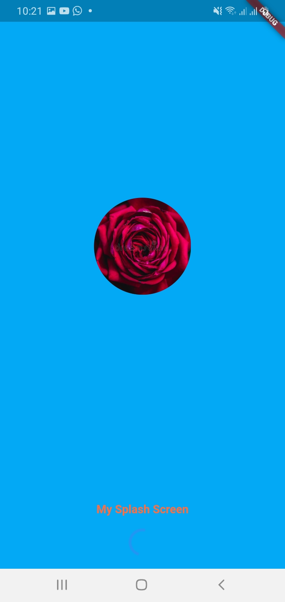
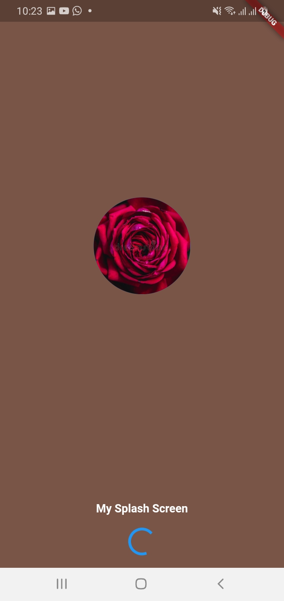

# Flutter SplashScreen Example

A new Flutter Splash Screen Example,Easy to build ,Support for both Android and iOS.

# Package

Add this package in your Pubspec.yaml

```yaml
dependencies:
  flutter:
    sdk: flutter
//Add this line
  mysplashscreen: ^0.0.1
```

//Add this code in your main.dart

Eg :-

```flutter
home: MySplashScreen(
          loadtimeSec: 10,
          loading: true,
        //  assetimage: "assets/images/test.png",
          networkimage: "https://cn.i.cdn.ti-platform.com/cnapac/content/2016/showpage/ben-10/in/showicon.png",
          //Next Screen mean After Spalsh Screen open new Widget
          nextscreen: Gonext(),
          backcolor: Colors.brown,
          bottomtext: 'My Splash Screen',
          bottomtextstyle: TextStyle(
              color: Colors.white, fontSize: 15, fontWeight: FontWeight.bold),
        ));
```

## Example Screens 

 &nbsp 

